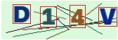
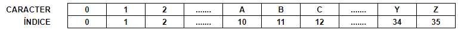
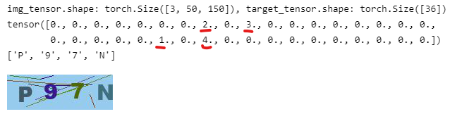
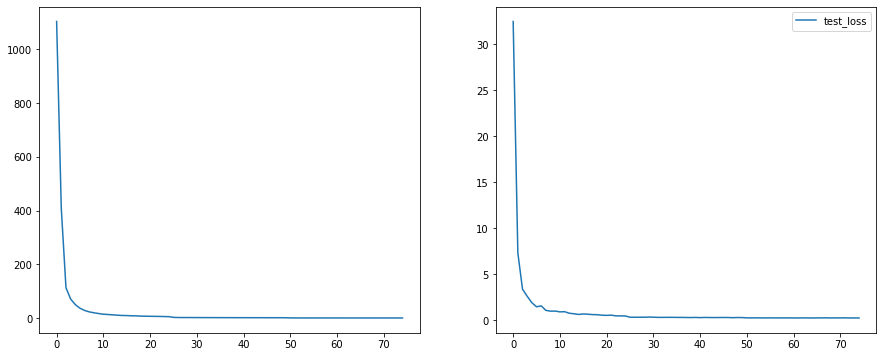
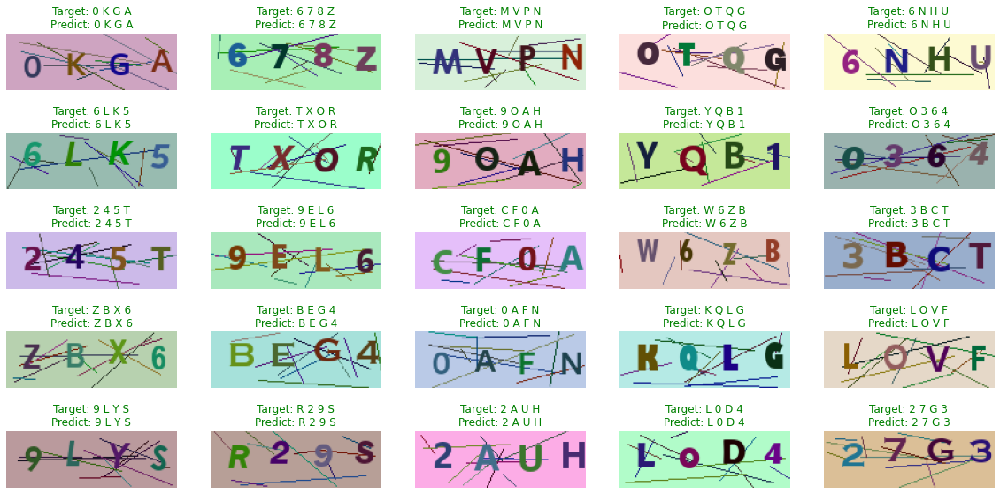

# RECONHECEDOR_CAPTCHAS

- O objetivo deste repositório é apresentar uma proposta diferente para reconhecimento de captchas.  A ideia principal não é analisar qual abordagem é melhor ou pior, mas sim mostrar uma alternativa de diferente. Sendo assim, essa proposta possui prós e contras que serão explicados mais a frente.

- Normalmente, para um trabalho desse tipo, a solução poderia ser a utilização de uma rede neural com arquitetura YOLO de  ```26+10=36 classes``` (26 letras e 10 dígitos) e com a tarefa de encontrar os objetos (letras e números) nas suas respectivas posições.  
Assim, bastaria ter as detecções e ordená-las por ordem crescente das posições no eixo horizontal, que teríamos a sequência de caracteres encontrados no captcha.  
  
A imagem acima seria um exemplo de 4 detecções. Assim, para ter o resultado, bastaria pegar as posições x0 (esquerda) de cada box e ordená-las na ordem crescente para ter a sequência: D14V

# Proposta deste trabalho

- Ao invés de criar uma rede neural YOLO para detecção de objetos (no caso letras e caracteres), a ideia é criar uma rede neural que, para cada imagem de entrada (3 canais, 150 de largura e 50 de altura), seria retornado um tensor de dimensão 36 (26 letras e 10 dígitos).
- Ou seja, o tensor de entrasa teria shape: [3, 50, 150] e o tensor de saída seria um tensor: [36].
- O tensor de saída tem uma dimensão de tamanho 36.  Os valores de várias posições são 0 e as posições que representam os índices dos caracteres encontrados na imagem receberiam valor 1. Uma ideia de dicionário dos caracteres e seus índices seria:  

  

- Porém fica uma dúvida. Se todos os valores são zero e os valores cujos índices dos caracteres encontrados teriam valor 1, como então saber a ordem ou sequência dos caracteres do captcha?

- A resposta (principal ideia deste trabalho) seria colocar um valor maior para a primeira posição (digamos valor 4), uma valor 3 para o índice do caracter da segunda posição e assim por diante.  
- Um exemplo de tensor saída para a imagem abaixo seria:  
  

- Perceba que a sequência é: P97N onde, pelo dicionário de letras-índices, o primeiro caracter "P" está na posiçao 25 (e que de fato, no dicionário de caracteres, a letra P tem índice 25), o segundo caracter "9" está na posição 9, o terceiro caracter "7" na posição 7 e quarto caracter N na posição 23, conforme o tensor acima da imagem. Assim, para cada posição, colocamos não somente o valor 1 para representar a presença desse caracter, mas sim um "peso" ou valor de ordem, onde o valor 4 representa primeira posição; valor 3, segunda posição; valor 2 terceira posição; valor 1 representa 4 posição e valor 0 representa que o índie do respectivo caracter não foi encontrado na imagem.

- Assim, uma vez definidas as premissas de como tratar o problema, criamos uma rede neural simples, que recebe uma imagem de 3 canais e tamanho 150x50 e retorna um tensor de 36 posições.  

# Função Perda
- A função perda será uma MSELoss() simples, como teste para ver se a rede neural converge.  
```
loss_fn = nn.MSELoss()
```

# Variáveis de Treinamento
```
CARACTERES = '0123456789ABCDEFGHIJKLMNOPQRSTUVWXYZ'
N_CLASSES = len(CARACTERES)
N_DIGITOS = 4
CHAR2IDX = {c: v for v, c in enumerate(CARACTERES)}
IDX2CHAR = {v: c for v, c in enumerate(CARACTERES)}
IMGW = 150
IMGH = 50
BATCH_SIZE = 16
LEARNING_RATE = 1e-3
EPOCHS = 75
```

# Resultados

- Pela análise da função perda ao longo das épocas podemos concluir que a rede neural convergiu bem.  
  

# Validação

- Também podemos criar novos captchas para validar o modelo e vemos o resultado:  
  

# Conclusão

- A proposta de reconhecer captchas automaticamente é interessante. Uma limitação deste modelo é que uma vez treinado a partir de um determinado número de caracteres (neste nosso exemplo foram 4, porém pode ser treinado para quantidade de caracteres) o modelo sempre responde um número fixo de caracteres preditos. Caso um captcha venha com um número de caracteres diferente do esperado, o resultado dificilmente será correto. (Já utilizando outras abordagens como detecção de objetos, essa dificuldade seria facilmente resolvida).
- Uma vantagem dessa abordagem é que o modelo treinado é muito simples e pequeno, de rápida inferência.
